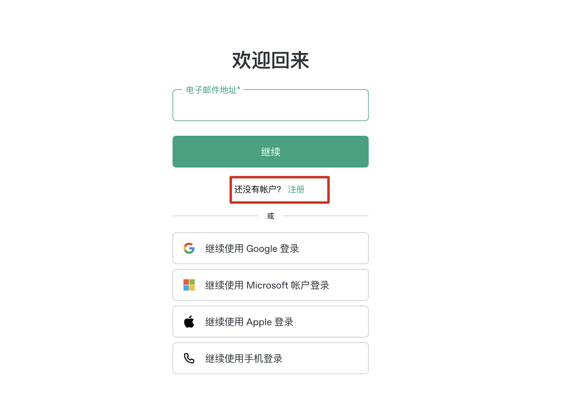
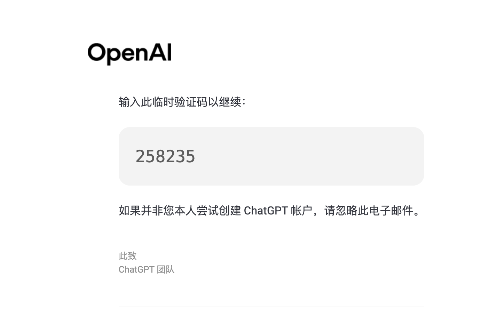
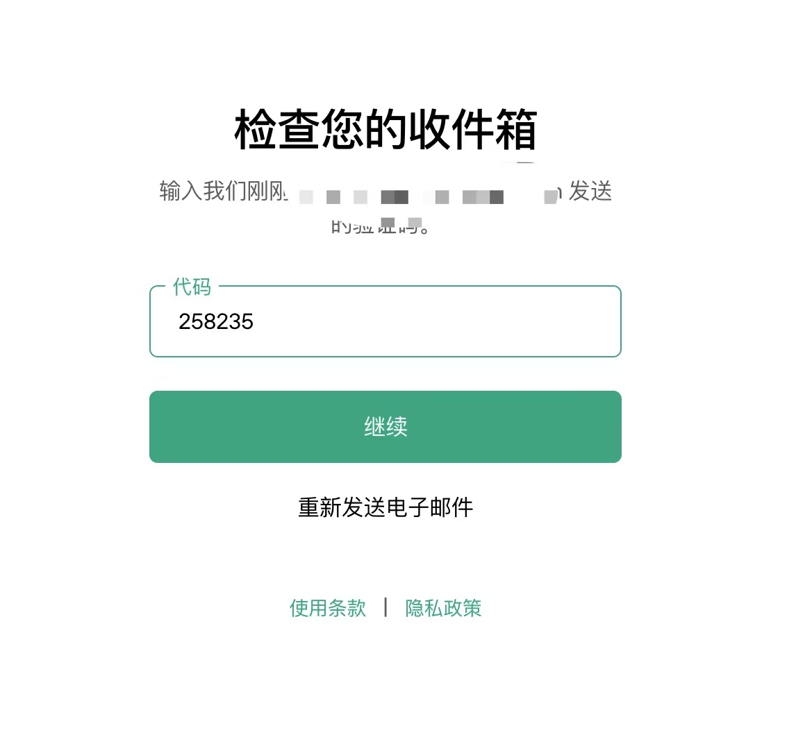
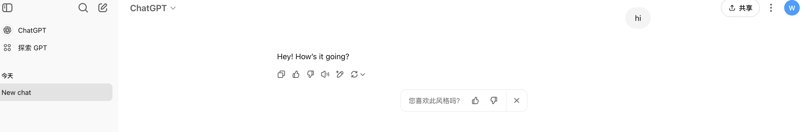

# ✅ 2025 ChatGPT 注册教程（免手机号 · 图文全流程）

欢迎来到 ChatGPT 助手站！

本教程将手把手教你如何注册 ChatGPT 免费账号。  
适用于中国大陆用户，无需海外手机号，仅需邮箱 + VPN，全程 5 分钟搞定。  
配有完整截图，建议使用电脑浏览器（Chrome/Edge）操作。

---

## 🧰 注册前准备

你只需要准备以下两样东西：

- 一个 Gmail（推荐）或 Outlook 邮箱
- 一款稳定的 VPN 或机场工具（推荐节点：美国、新加坡、日本）

---

## 🪜 注册步骤（全流程截图）

### 1️⃣ 打开官网：https://chat.openai.com  
确保你已成功连接 VPN

---

### 2️⃣ 点击右上角「Sign up」  

---

### 3️⃣ 输入你的邮箱地址  
建议使用 Gmail  

---

### 4️⃣ 设置一个密码  

---

### 5️⃣ 登录邮箱，查收验证码邮件  

---

### 6️⃣ 回到注册页面，填写验证码  

---

### 7️⃣ 输入姓名和出生日期  
建议填写 18 岁以上，信息无需真实  

---

### 8️⃣ 注册完成，进入 ChatGPT 主界面！  
🎉 你现在可以开始使用 ChatGPT 啦！  

---

## ✅ 免费账号支持的功能（2025）

你现在拥有的是 ChatGPT 免费账号，可使用 GPT-4o 模型的基础功能，包括：

- GPT-4o mini 模型（快速 + 多模态）
- 实时联网搜索能力
- 文件上传（有限次）
- 图片生成（有限次）
- 标准语音模式
- 使用和创建自定义 GPT

---

## 💳 想解锁更多强大功能？建议升级 ChatGPT Plus

ChatGPT Plus（$20/月）支持：

- 高速访问 GPT-4.5（含研究预览）
- 扩展使用：文件上传、网页浏览、高级分析、图片生成
- 支持 GPT 项目任务执行
- 限量测试 Sora 视频生成功能
- 更高频次、更多资源访问权限

👉 [点此查看升级教程（含虚拟卡推荐）](https://chatgpt-helper-tech.github.io/chatgpt-plus-guide/)

---

## ❓ 常见问题解答

| 问题 | 解决方法 |
|------|----------|
| 无法打开官网 | 检查 VPN 状态，建议切换节点或更换机场 |
| 邮箱收不到验证码 | 建议使用 Gmail，检查垃圾箱 |
| 注册跳出手机号验证 | 多刷新页面或更换浏览器尝试（多数用户已不再遇到） |

---

## 📚 推荐配套教程

- 🔐 [2025 最推荐 VPN 工具榜单](https://chatgpt-helper-tech.github.io/network-access/)
- 🚀 [2025 稳定机场推荐榜单](https://chatgpt-helper-tech.github.io/airport-guide/)
- 💳 [虚拟信用卡注册指南（升级 Plus 专用）](https://chatgpt-helper-tech.github.io/virtualcard/)

---

📬 如果你觉得本教程对你有帮助，欢迎 Star 收藏支持我们！

🌐 官方主页：[https://chatgpt-helper-tech.github.io](https://chatgpt-helper-tech.github.io)  
📂 GitHub 项目地址：[https://github.com/chatgpt-helper-tech](https://github.com/chatgpt-helper-tech)
