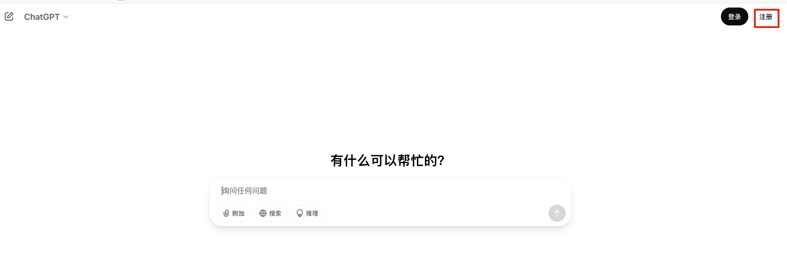
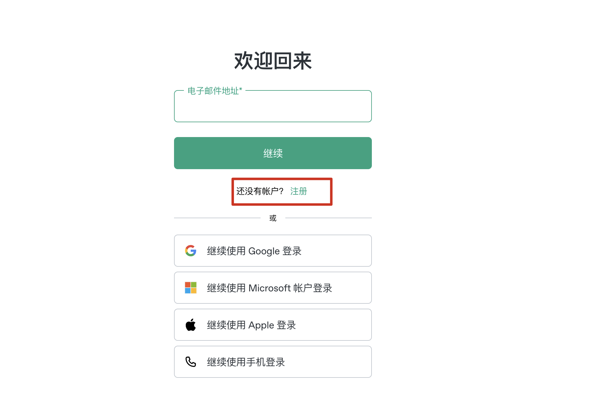
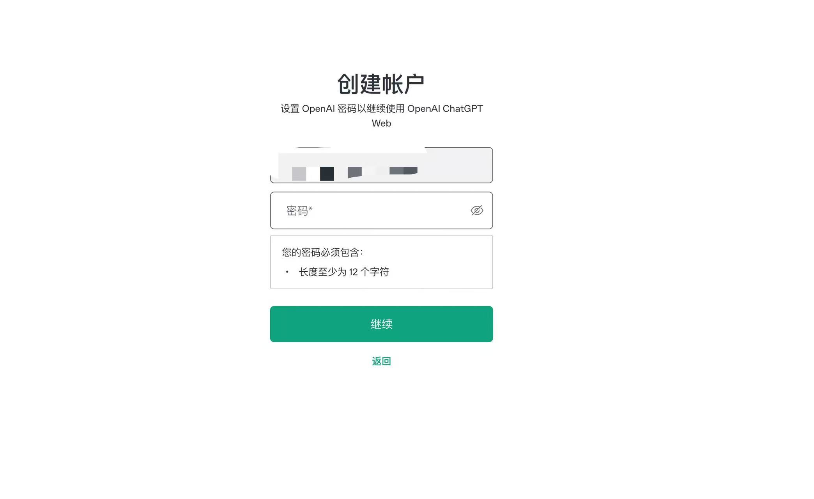
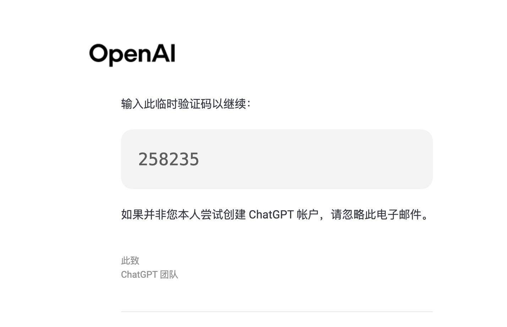
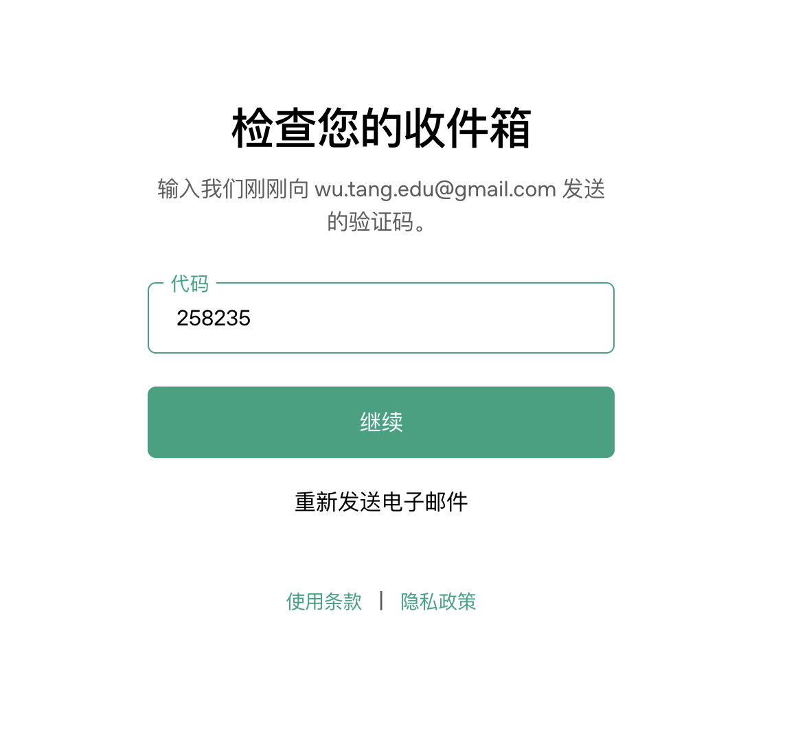
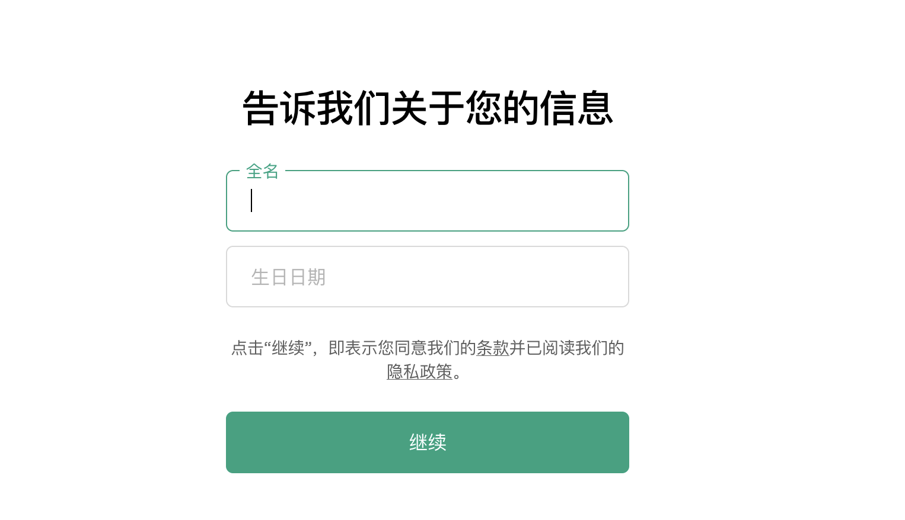
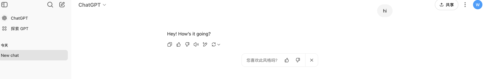

# 📝 ChatGPT 注册教程（适用于中国用户 · 2025 最新）

欢迎来到 ChatGPT 中文助手注册教程页面！

如果你想免费注册属于你自己的 ChatGPT 账号，并顺利体验 GPT-4o 模型，但又因为无法访问官网、注册失败、收不到验证码等原因而烦恼——这个教程将为你提供全图文分步的解决方案 ✅

---

## 🔍 为什么自己注册比“买号 / 合租”更值得？

| 方式 | 风险 |
|------|------|
| 买号 | 黑卡注册，随时封号，不可绑定自己设置 |
| 合租 | 多人共享，记录隐私泄露，功能有限 |
| 自己注册 | ✅ 安全私密、随时升级、自主控制 |

---

## 🌐 无法访问官网怎么办？

如果你无法访问 [https://chat.openai.com](https://chat.openai.com)，请使用以下临时跳板工具：

👉 [免费注册 V2free（每日免费流量）](https://w1.v2free.cc/auth/register?code=i0A3)

使用该免费机场即可加载 ChatGPT 官网、注册流程与邮箱验证页。

---

## ✨ ChatGPT 注册流程（图文详解 · 共 8 步）

### 1️⃣ 打开官网：https://chat.openai.com  
确保你已连接 VPN 或机场节点，成功打开页面。

---

### 2️⃣ 点击右上角「Sign up」  

---

### 3️⃣ 输入你的邮箱地址  
建议使用 Gmail，避免验证码收不到。  

---

### 4️⃣ 设置一个密码  
不少于 8 位，建议包含大小写与数字组合。  

---

### 5️⃣ 登录邮箱，查收验证码邮件  

---

### 6️⃣ 回到注册页面，填写验证码  

---

### 7️⃣ 输入姓名和出生日期  
建议填写 18 岁以上，信息无需真实。  

---

### 8️⃣ 注册完成，进入 ChatGPT 主界面！  
🎉 你现在可以开始使用 ChatGPT 啦！  

---

## ✅ 注册后你能使用什么功能？

| 功能 | 免费账号（GPT-4o） | Plus 用户（GPT-4.5） |
|------|--------------------------|------------------------|
| 聊天模型 | GPT-4o  | GPT-4.5 / o3 系列 |
| 搜索 / 语音 / 图片 | ✅ 基础可用 | ✅ 无限高质 |
| 文件上传 | ✅ 支持 | ✅ 批量处理 |
| 插件 / 自定义 GPT | ✅ 可用 | ✅ 完全解锁 |

---

## 📚 继续探索 · 配套教程推荐

- [💳 ChatGPT Plus 升级教程](https://chatgpt-helper-tech.github.io/chatgpt-plus-guide/)
- [🔐 2025 VPN 推荐指南（科学上网工具）](https://chatgpt-helper-tech.github.io/network-access/)
- [✈️ 2025 科学上网机场推荐榜单](https://chatgpt-helper-tech.github.io/airport-access/)
- [📘 中文主页 · 教程导航站](https://chatgpt-helper-tech.github.io/)

---

📬 本教程由 [chatgpt-helper-tech](https://github.com/chatgpt-helper-tech) 维护  
欢迎 Star 收藏，本站长期更新中文用户专用的 AI 工具教程 🔧
